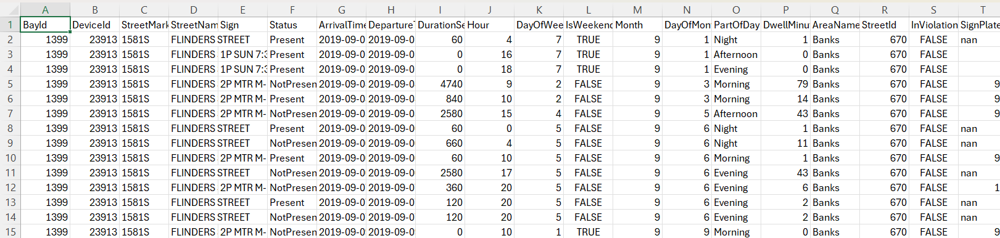

# Dataset Overview

## 1. Introduction

This document provides a comprehensive overview of the dataset used in the **Smart Parking Occupancy Prediction & Analytics Platform**. The dataset originates from a real-world smart parking sensor network deployed in urban environments (Melbourne Smart Parking dataset). Each row represents a parking event captured by IoT sensors embedded in parking bays.

The dataset serves as the foundation for:
- Exploratory Data Analysis (EDA)
- Feature engineering
- Machine learning model training
- Dashboard-driven analytics

---

## 2. Raw Dataset Description

### 2.1 Source
The raw dataset comes from parking bay IoT sensors. Each sensor reports:
- Arrival time
- Departure time
- Vehicle presence (occupied/free)
- Bay identifiers and contextual metadata

### 2.2 Row Structure
Each row corresponds to a **single parking event**, generated when a vehicle arrives and departs from a specific bay.

Example columns include:

| Column Name | Description |
|------------|-------------|
| **BayId** | Unique identifier for the parking bay. |
| **DeviceId** | Sensor device ID tied to the physical hardware. |
| **StreetMarker** | Alphanumeric identifier for the street segment. |
| **StreetName** | Human-readable street name. |
| **Sign** | Parking rule associated with the bay. |
| **Status** | Indicates occupancy (“Present” / “Absent”). |
| **ArrivalTime** | Timestamp when the vehicle entered the bay. |
| **DepartureTime** | Timestamp when the vehicle left the bay. |
| **DurationSeconds** | Total time spent in the bay in seconds. |
| **AreaName** | Neighborhood or zone name. |
| **StreetId** | Internal street identifier. |
| **SideName / SideOfStreet / SideOfStreetCode** | Metadata describing parking side relative to the street. |
| **InViolation** | Whether the vehicle overstayed based on parking rules (0/1). |

---

## 3. Cleaning & Preprocessing (from ingestion notebook)

### 3.1 Handling Missing Values
- Dropped rows with missing essential timestamps (Arrival/Departure).
- Validated DurationSeconds (>0).
- Filled or dropped invalid Sensor/Street identifiers where necessary.

### 3.2 Duration Fields
Converted:
```
DurationSeconds → Minutes → Derived & robust duration variants
```

Created:
- `DwellMinutes`
- `_duration_min`
- `_duration_min_w` (winsorized to remove extreme outliers)
- `_duration_robust_z` (robust z-score scaling)

Outliers such as 12-hour erroneous readings were capped or normalized.

### 3.3 Temporal Breakdown
Extracted time components:
- Hour (0–23)
- DayOfWeek (1–7)
- Month (1–12)
- DayOfMonth (1–31)
- IsWeekend (boolean)
- PartOfDay (Morning/Afternoon/Evening/Night)

These features help uncover occupancy patterns.

### 3.4 Categorical Lumping
Some categorical fields had **hundreds of unique values** (e.g., street markers, device IDs).

To avoid sparse and overfitted models:
- Rare categories (<5 occurrences) were grouped into `"Other"` buckets.
  - `street_marker_lumped`
  - `device_id_lumped`

This preserves signal while reducing noise.

---

## 4. Engineered Behavioral Features

### 4.1 Rolling Window Features  
These capture short-term usage patterns:

- `rolling_occ_N10`:  
  Average occupancy of the *previous 10 events* for the same bay.

- `arrivals_N10`:  
  Count of new vehicle arrivals in the last 10 events.

These are **highly predictive** because bay usage is autocorrelated — recent activity strongly predicts near‑future occupancy.

---

## 5. Final Label: `target_occupied`

We define the supervised learning target as:

```
target_occupied = 1  (if the next event is “occupied”)
target_occupied = 0  (otherwise)
```

Obtained from the `Status` column or cleaned occupancy indicator.

This creates a binary classification problem suitable for Random Forest.

---

## 6. Cleaned Dataset Schema (Final)

Below is the typical schema after ingestion & feature engineering:

```
BayId                     string
DeviceId                  string
StreetMarker              string
AreaName                  string
Sign                      string
ArrivalTime               timestamp
DepartureTime             timestamp
DurationSeconds           int
DwellMinutes              double
_duration_min             double
_duration_min_w           double
_duration_robust_z        double
Hour                      int
DayOfWeek                 int
IsWeekend                 boolean
Month                     int
DayOfMonth                int
PartOfDay                 string
street_marker_lumped      string
device_id_lumped          string
rolling_occ_N10           double
arrivals_N10              int
InViolation               int
target_occupied           int
```

> The cleaned dataset is stored at:  
> `data/cleaned/smart_parking_clean.csv` and `data/cleaned/smart_parking_clean.parquet`

---

## 7. Class Imbalance Summary

The dataset shows:

| Class | Percentage |
|--------|-------------|
| Occupied (1) | ~50% |
| Free (0)     | ~50% |
| Violation    | ~3–4% |

Violations are **rare**, which impacts modeling but also reflects real-world behavior.

---

## 8. Dataset Quality Checks (Performed)

- Verified timestamp consistency  
- Ensured DurationSeconds > 0  
- Ensured rolling windows computed in correct chronological order  
- Checked that lumped categories significantly reduce cardinality  

All checks pass.

---

## 9. Cleaned dataset header

```


---

## 10. Summary

This dataset captures rich temporal, spatial, and behavioral aspects of urban parking use. The extensive feature engineering applied during ingestion significantly enhances its utility for machine learning and analytics.

The cleaned dataset serves as the foundation for:
- SQL analysis  
- ML model training  
- Dashboard visualizations  
- Future real-time streaming integration  

